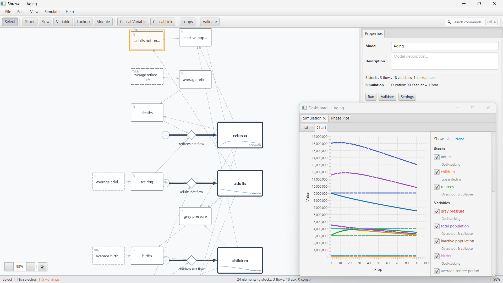

# Shrewd — System Dynamics Modeling Tool

> **Alpha-1 Release** — This system is at Alpha-1 release readiness and is not ready for production use. APIs, file formats, and features may change without notice.

Shrewd is an open-source [System Dynamics](userdocs/Key%20Reasons%20for%20Using%20System%20Dynamics.md) simulation engine and visual modeling environment for Java. It provides two ways to build and run models:

- **Visual Editor** — a JavaFX canvas-based GUI for interactively building stock-and-flow diagrams and causal loop diagrams
- **Programmable Engine** — a code-first Java API for defining, compiling, and running models programmatically

The engine supports creating training simulations, games, scenario testing, and planning models across domains including ecology, epidemiology, project management, software development, business strategy, economics, demographics, and supply chain management.

## Feature Highlights

- **Stock-and-flow modeling** — stocks, flows, variables, constants, lookup tables, and subscripts/arrays
- **Causal loop diagrams** — CLD variables, signed causal links (+/−), automatic loop detection with reinforcing (R) / balancing (B) classification
- **Equation editor** — multi-line editor with syntax highlighting, function autocomplete, and inline canvas editing
- **Simulation analysis** — parameter sweep, multi-parameter sweep, Monte Carlo sampling, and optimization (BOBYQA, CMA-ES, Nelder-Mead)
- **Scenario comparison** — run multiple simulations with different parameters and overlay results as color-differentiated ghost runs
- **Feedback loop analysis** — automatic detection and highlighting of feedback loops in stock-and-flow diagrams
- **Model validation** — structural validation with error/warning indicators on canvas elements
- **Delay detection** — visual "D" badges on elements containing delay functions (SMOOTH, DELAY3, DELAY_FIXED)
- **Canvas features** — sparklines in stocks, resizable elements, undo/redo, zoom, diagram export (PNG/JPG)
- **Import/export** — Vensim `.mdl` import, XMILE import/export, native JSON persistence
- **35 bundled example models** spanning epidemiology, ecology, economics, demographics, supply chain, technology adoption, and more

## Screenshots



## Installation

### Requirements

- **Java 25** or later
- **Maven 3.x** (to build from source)

### Build from Source

```bash
git clone https://github.com/Courant-Systems/shrewd.git
cd shrewd
mvn clean package -DskipTests
```

### Run the Visual Editor

```bash
java -jar shrewd-app/target/shrewd-app-*.jar
```

Open an example model via **File → Open Example** to explore the 35 bundled models.

## Quick Start

### Visual Editor

1. Launch the application
2. **File → Open Example → Introductory → Exponential Growth** to open a simple model
3. Click **Simulate → Run Simulation** to run it
4. Modify parameter values by double-clicking constants on the canvas
5. Re-run to compare results as ghost runs

See the [Quickstart Tutorial](userdocs/Quickstart.md) for a 10-minute hands-on walkthrough building a coffee cooling model.

### Programmable Engine

Build and run an SIR epidemic model in pure Java:

```java
Model model = new Model("SIR Epidemic");

Stock susceptible = new Stock("Susceptible", 1000, PEOPLE);
Stock infectious  = new Stock("Infectious", 10, PEOPLE);
Stock recovered   = new Stock("Recovered", 0, PEOPLE);

Flow infection = Flow.create("Infection", DAY, () -> {
    double totalPop = susceptible.getValue() + infectious.getValue()
            + recovered.getValue();
    double infectiousFraction = infectious.getValue() / totalPop;
    return new Quantity(
            8.0 * infectiousFraction * 0.1 * susceptible.getValue(), PEOPLE);
});

Flow recovery = Flow.create("Recovery", DAY, () ->
        new Quantity(infectious.getValue() * 0.2, PEOPLE));

susceptible.addOutflow(infection);
infectious.addInflow(infection);
infectious.addOutflow(recovery);
recovered.addInflow(recovery);

model.addStock(susceptible);
model.addStock(infectious);
model.addStock(recovered);

Simulation sim = new Simulation(model, DAY, Times.weeks(8));
sim.addEventHandler(new StockLevelChartViewer());
sim.execute();
```

Or define models as data and compile them:

```java
ModelDefinition def = new ModelDefinitionBuilder()
    .name("Population Model")
    .stock("Population", 1000, "Person")
    .flow("Births", "Population * birth_rate", "Year", null, "Population")
    .constant("birth_rate", 0.03, "1/Year")
    .defaultSimulation("Day", 365, "Day")
    .build();

CompiledModel compiled = new ModelCompiler().compile(def);
compiled.createSimulation().execute();
```

See [Programmable Engine](userdocs/Programmable%20Engine.md) for the full API reference. The 23 runnable demos in `shrewd-demos` cover exponential growth, delays, feedback, epidemiology, predator-prey, inventory management, and software development models.

## Core Concepts

System Dynamics models represent a system as a network of stocks, flows, and feedback loops. Stocks capture the state of the system — things like population, inventory, or debt. Flows represent the processes that change stocks over time — births, shipments, or interest payments. Variables and constants parameterize the relationships between them. These elements are connected into feedback loops — circular causal chains where effects feed back to influence their own causes — which drive the dynamic behavior of the system.

### Stock-and-Flow Diagrams

- **Stocks** — accumulations representing system state (e.g., population, inventory)
- **Flows** — rates of change that add to or drain from stocks
- **Variables** — calculated quantities derived from formulas, including fixed constants that serve as model parameters
- **Lookup Tables** — piecewise interpolation curves for nonlinear effects
- **Subscripts / Arrays** — dimensions that expand elements into parallel instances (e.g., by region or cohort)

### Causal Loop Diagrams

Shrewd also supports **Causal Loop Diagrams (CLDs)** — the qualitative diagramming technique used in early-stage system dynamics modeling:

- **CLD Variables** — qualitative concepts with no equation or unit
- **Causal Links** — directed connections with polarity: positive (+), negative (−), or unknown (?)
- **Automatic Loop Detection** — finds feedback cycles and classifies them as reinforcing (R) or balancing (B)
- **Classification** — CLD variables can be converted into S&F elements (stock, flow, auxiliary, constant)

CLDs and S&F elements share a single canvas and model definition.

## Architecture

### Modules

| Module | Purpose |
|---|---|
| **shrewd-engine** | Core simulation engine, model definitions, expression AST and parser, two-pass compiler, dependency graphs, dimensional analysis, parameter sweeps, Monte Carlo, optimization, JSON/Vensim/XMILE I/O |
| **shrewd-ui** | JavaFX chart visualization components |
| **shrewd-demos** | 23 runnable example programs with source code |
| **shrewd-app** | Visual editor application with canvas-based GUI, inline editing, simulation, and analysis |
| **shrewd-tools** | Model analysis and transformation utilities |

## Model Import & Export

Shrewd can exchange models with other System Dynamics tools:

- **Vensim `.mdl` import** — reads Vensim model files including stocks, flows, auxiliaries, constants, lookup tables, subscripts, sketch data, and simulation settings. See [Vensim Import](userdocs/Vensim%20Import.md).
- **XMILE import & export** — bidirectional exchange with Stella/iThink via the OASIS standard XML format. See [XMILE Import & Export](userdocs/XMILE%20Import%20Export.md).
- **JSON** — native round-trip persistence format. See [Programmable Engine](userdocs/Programmable%20Engine.md#json-serialization).

## Example Models

### Programmable Engine Demos

| Category | Models |
|---|---|
| **Fundamental** | Exponential growth/decay, coffee cooling, bathtub, S-shaped growth, flow time conversion, lookup tables |
| **Delays** | First-order material delay, third-order material delay, FIFO pipeline delay |
| **Feedback & Interaction** | SIR epidemic (+ sweep, multi-sweep, Monte Carlo, calibration variants), multi-region SIR with subscripts, population by region × age, predator-prey, inventory with delays, sales mix |
| **Software Development** | Agile project with rework dynamics, waterfall project with composable modules |

### Visual Editor Bundled Models

35 models across 11 categories accessible via **File → Open Example**: introductory, demographics, ecology, economics, epidemiology, management, policy, population, supply chain, technology, and more.

## Documentation

| Document | Contents |
|---|---|
| [Quickstart Tutorial](userdocs/Quickstart.md) | Build your first model in 10 minutes |
| [Visual Editor Guide](userdocs/Visual%20Editor%20Guide.md) | GUI features, tools, keyboard shortcuts, simulation, analysis |
| [Programmable Engine](userdocs/Programmable%20Engine.md) | Code API: lambda-based models, definitions, compiler, expressions, sweep/Monte Carlo/optimization |
| [Expression Language](userdocs/Expression_Language.md) | Equation syntax, operators, and built-in functions reference |
| [From Vensim PLE](userdocs/From_Vensim_PLE.md) | Migration guide for Vensim PLE users |
| [Vensim Import](userdocs/Vensim%20Import.md) | Vensim `.mdl` import: supported constructs and limitations |
| [XMILE Import & Export](userdocs/XMILE%20Import%20Export.md) | XMILE import/export: supported constructs and limitations |

## Learning System Dynamics

- [Why System Dynamics?](userdocs/Key%20Reasons%20for%20Using%20System%20Dynamics.md) — when and why to use this approach
- [Thinking in Systems: A Primer](https://www.chelseagreen.com/product/thinking-in-systems/) by Donella Meadows
- [MIT OCW: Introduction to System Dynamics](https://ocw.mit.edu/courses/15-871-introduction-to-system-dynamics-fall-2013/)
- [MIT OCW: System Dynamics Self Study](https://ocw.mit.edu/courses/15-988-system-dynamics-self-study-fall-1998-spring-1999/)
- [System Dynamics Society: Introduction](https://systemdynamics.org/introduction-to-system-dynamics-modeling/)
- [Small System Dynamics Models for Big Issues](https://simulation.tudelft.nl/SD/index.html) by Erik Pruyt (TU Delft, 2013) — free e-book covering real-world SD modeling with many worked examples

## License

This project is licensed under the [GNU Affero General Public License v3.0](LICENSE). Demo models and imported third-party models carry separate Creative Commons licenses. See [LICENSING.md](LICENSING.md) for the full breakdown of how source code, original models, and third-party models are licensed.

## Support

See [Support](userdocs/Support.md) for how to get help, report bugs, and request features.
